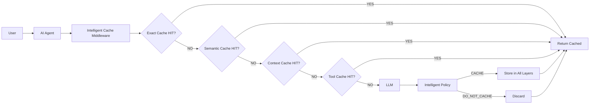
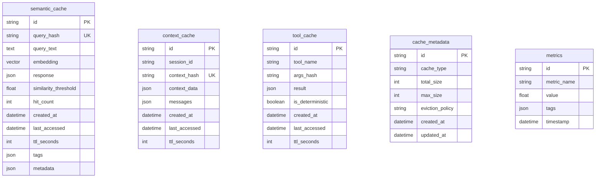

# Intelligent Caching Optimization Middleware for AI Agents

## 1. Project Overview

This project is an M.Tech-level demonstration of **intelligent multi-level caching** for AI agent systems. It reduces redundant LLM calls, latency, token usage, and inference costs by combining exact matching, semantic similarity, context awareness, tool determinism, and an explainable cache policy with weighted scoring.

The system is built as a production-style FastAPI service with Redis for exact/tool caching, PostgreSQL with pgvector for semantic caching, and a modular LLM provider layer supporting mock, OpenAI, and Ollama backends.

---

## 2. Tech Stack

| Component | Technology | Version |
|-----------|-----------|---------|
| Backend | Python 3.11+ / FastAPI / Uvicorn | 0.109.0 / 0.27.0 |
| Caching | Redis (exact / response / context / tool) | 7 (via Docker) |
| Database | PostgreSQL + pgvector | 16 + pgvector |
| Embeddings | Sentence Transformers | all-MiniLM-L6-v2 |
| LLM | OpenAI-compatible API, Ollama, Mock provider | - |
| Frontend | Streamlit | 1.30.0 |
| Testing | Pytest, HTTPX | 8.0.0 / 0.26.0 |
| Visualization | Matplotlib, Plotly | - |
| Infrastructure | Docker Compose | - |

---

## 3. System Architecture



### 3.1 Request Flow

1. **Query arrives** at the FastAPI `/generate` endpoint
2. **Cache middleware** checks layers in order: Exact → Semantic → Context → Tool
3. **Cache HIT** returns the cached response immediately (~10-15ms)
4. **Cache MISS** calls the LLM provider, then applies the intelligent policy
5. **Policy decision** determines whether to store the result and for how long
6. **Response** is returned to the client with metadata (cache status, latency, savings)

---

## 4. Application Layer

### 4.1 Directory Structure

```
app/
├── __init__.py
├── main.py                    # FastAPI app entrypoint
├── config.py                  # Pydantic settings
├── api/
│   ├── __init__.py
│   ├── routes.py              # API endpoints
│   └── schemas.py             # Pydantic request/response models
├── cache/
│   ├── __init__.py
│   ├── base.py                # Abstract base cache
│   ├── exact_cache.py         # Redis exact match cache
│   ├── semantic_cache.py      # PostgreSQL/pgvector semantic cache
│   ├── context_cache.py       # PostgreSQL context cache
│   ├── tool_cache.py          # Redis tool result cache
│   ├── manager.py             # Cache orchestrator
│   └── policy.py              # Simple cache policy
├── intelligence/
│   ├── __init__.py
│   ├── scorer.py              # Intelligent cache scoring
│   └── eviction.py            # LRU eviction policy
├── embeddings/
│   ├── __init__.py
│   └── encoder.py             # Sentence transformer encoder
├── llm/
│   ├── __init__.py
│   ├── base.py                # Abstract LLM base
│   ├── openai_provider.py     # OpenAI-compatible provider
│   ├── ollama_provider.py     # Ollama provider
│   ├── mock_provider.py       # Mock LLM for demo
│   └── factory.py             # LLM provider factory
├── agent/
│   ├── __init__.py
│   └── tools.py               # Deterministic agent tools
├── database/
│   ├── __init__.py
│   ├── models.py              # SQLAlchemy models
│   └── session.py             # DB session management
└── metrics/
    ├── __init__.py
    └── collector.py           # Performance metrics
```

### 4.2 Core Components

#### `app/main.py` - FastAPI Application
- Defines the FastAPI app with CORS middleware
- Handles lifespan events (database initialization)
- Serves health checks and API docs at `/docs`

#### `app/api/routes.py` - API Layer
- `POST /generate` - Main endpoint for LLM generation with caching
- `GET /health` - Health check with Redis and PostgreSQL status
- `GET /metrics` - Performance metrics
- `GET /cache/stats` - Cache statistics
- `GET /cache/entries` - Cached entries browser
- `GET /cache/decisions` - Recent cache policy decisions
- `DELETE /cache` - Clear all caches
- `POST /cache/invalidate` - Invalidate specific query

#### `app/cache/manager.py` - Cache Orchestrator
Coordinates all cache layers with fallback logic:
1. Check exact cache (Redis SHA256 key)
2. Check semantic cache (pgvector cosine similarity)
3. On miss, call LLM and apply intelligent policy
4. Store results based on policy decision

#### `app/intelligence/scorer.py` - Intelligent Policy
Computes explainable cache scores using weighted factors:

| Factor | Weight | Description |
|--------|--------|-------------|
| Frequency Score | 0.20 | How often query repeats |
| Similarity Score | 0.25 | Semantic similarity to cached entries |
| Recency Score | 0.15 | Time since last access |
| Reuse Probability | 0.20 | Likelihood of future reuse |
| Estimated Cost | 0.10 | LLM inference cost |
| Memory Penalty | 0.10 | Storage cost of caching |

**Decision Types:**
- `CACHE` (score >= 0.85) — High score, long TTL
- `CACHE_WITH_SHORT_TTL` (score >= 0.70) — Moderate score, short TTL
- `CACHE_WITH_LONG_TTL` (score >= 0.50) — Borderline score, long TTL
- `DO_NOT_CACHE` (score < 0.50) — Low score, transient query

#### `app/llm/` - LLM Provider Layer
- **MockProvider**: Deterministic responses for benchmarking (configurable latency)
- **OpenAIProvider**: OpenAI-compatible API integration
- **OllamaProvider**: Local Ollama model support
- **Factory pattern**: Dynamic provider selection via `LLM_PROVIDER` env var

#### `app/embeddings/encoder.py` - Embedding Engine
- Primary: `all-MiniLM-L6-v2` via Sentence Transformers
- Fallback: Hash-based embedding if sentence-transformers unavailable
- Supports batch encoding for efficiency

#### `app/agent/tools.py` - Deterministic Tools
- `calculator`: Safe AST-based math evaluation
- `document_lookup`: Keyword-based document search
- `mock_weather`: Deterministic mock weather reports
- All tools are idempotent and cache-safe

---

## 5. Cache Types

### 5.1 Exact Cache (Redis)
- SHA256 deterministic key generation from normalized query text
- TTL-based expiration (default 3600s)
- LRU-style eviction when max entries reached
- Hit count and last-accessed tracking

### 5.2 Semantic Cache (PostgreSQL + pgvector)
- `all-MiniLM-L6-v2` embeddings (384 dimensions)
- Cosine similarity search using pgvector `<=>` operator
- Configurable threshold (default 0.85)
- Detects paraphrased queries

**Example:**
```
"What is RAG?"
"Explain Retrieval Augmented Generation"
→ Semantic similarity: 0.92 → CACHE HIT
```

### 5.3 Context Cache (PostgreSQL)
- Session-based conversation context
- Reusable system instructions
- TTL-based context expiration (default 1800s)

### 5.4 Tool Cache (Redis)
- Deterministic tool result caching
- Safe caching for idempotent operations
- TTL-based expiration (default 7200s)

### 5.5 Intelligent Cache Policy
Explainable scoring model with configurable weights. The policy decides:
- Whether to cache a response
- Which cache layers to use
- What TTL to apply

This prevents caching of low-value or transient queries while maximizing reuse of high-value responses.

---

## 6. Data Files

The `data/` directory contains reference documents used for document lookup and RAG-style queries:

| File | Description |
|------|-------------|
| `data/employee_handbook.txt` | Employee policies, code of conduct, benefits, leave |
| `data/remote_work_policy.txt` | Remote/hybrid work policies, home office requirements |
| `data/security_policy.txt` | Information security, access control, incident response |
| `data/expense_policy.txt` | Travel, meals, entertainment, reimbursement rules |

These files can be ingested by the `document_lookup` tool or used as context for semantic caching demonstrations.

### Query Workload
Synthetic queries are generated by `app/benchmark/workload.py` with the following distribution:

| Query Type | Percentage | Description |
|-----------|-----------|-------------|
| `exact_repeat` | 20% | Exact duplicate queries |
| `strong_semantic` | 25% | Paraphrased queries |
| `weak_semantic` | 10% | Related but different queries |
| `hot` | 15% | Frequently repeated queries |
| `unique` | 15% | One-of-a-kind queries |
| `cold` | 10% | Low-value casual queries |
| `dynamic_stale` | 5% | Time-sensitive queries |

---

## 7. How to Run

### 7.1 Prerequisites

- Python 3.11 or higher
- Docker & Docker Compose
- Redis 7 (via Docker Compose)
- PostgreSQL 16 with pgvector (via Docker Compose)

### 7.2 Setup

```bash
# 1. Clone the repository
cd intelligent-ai-cache

# 2. Create virtual environment
python -m venv venv
source venv/bin/activate  # On Windows: venv\Scripts\activate

# 3. Install dependencies
pip install -r requirements.txt

# 4. Copy environment configuration
cp .env.example .env

# 5. Start infrastructure
docker compose up -d

# 6. Initialize database
python -c "from app.database.session import init_db; init_db(); print('Database initialized')"
```

### 7.3 Start Services

```bash
# Terminal 1: Start FastAPI server
uvicorn app.main:app --host 0.0.0.0 --port 8000

# Terminal 2: Start Streamlit dashboard
streamlit run dashboard/app.py --server.address 0.0.0.0 --server.port 8501
```

### 7.4 Run Benchmark

```bash
# Quick benchmark (50 queries, 100ms mock delay)
BENCHMARK_QUERIES=50 BENCHMARK_LLM_DELAY_MS=100 python scripts/benchmark.py

# Full benchmark (200 queries, 100ms mock delay)
BENCHMARK_QUERIES=200 BENCHMARK_LLM_DELAY_MS=100 python scripts/benchmark.py

# With custom parameters
BENCHMARK_QUERIES=500 BENCHMARK_SEED=42 BENCHMARK_RUNS=3 BENCHMARK_LLM_DELAY_MS=50 python scripts/benchmark.py
```

### 7.5 Run Tests

```bash
# Run all tests
pytest tests/ -v

# Run with coverage
pytest tests/ -v --cov=app --cov-report=html
```

### 7.6 Quick Start Script

```bash
# One-command setup (installs deps, starts Docker, initializes DB, starts servers)
bash run.sh
```

---

## 8. Configuration

Edit `.env` to customize behavior:

```env
# LLM Configuration
LLM_PROVIDER=mock  # Options: mock, openai, ollama
OPENAI_API_KEY=sk-your-key-here
OPENAI_MODEL=gpt-3.5-turbo
OLLAMA_BASE_URL=http://localhost:11434/v1
OLLAMA_MODEL=llama2

# Embedding Configuration
EMBEDDING_MODEL=all-MiniLM-L6-v2
EMBEDDING_DIMENSION=384

# Cache TTLs (seconds)
CACHE_EXACT_TTL=3600
CACHE_SEMANTIC_TTL=86400
CACHE_CONTEXT_TTL=1800
CACHE_TOOL_TTL=7200

# Cache Policy
CACHE_SEMANTIC_THRESHOLD=0.85
CACHE_MAX_SIZE=10000
CACHE_LRU_EVICTION=true
CACHE_SCORE_THRESHOLD=0.5
CACHE_SHORT_TTL=300
CACHE_LONG_TTL=86400

# Intelligent Policy Weights
WEIGHT_FREQUENCY=0.20
WEIGHT_SIMILARITY=0.25
WEIGHT_RECENCY=0.15
WEIGHT_REUSE=0.20
WEIGHT_COST=0.10
WEIGHT_MEMORY=0.10

# Mock LLM (for demo without external API)
MOCK_LLM_DELAY_MS=1000

# Server
API_PORT=8000
DASHBOARD_PORT=8501
LOG_LEVEL=INFO
METRICS_ENABLED=true
```

---

## 9. API Reference

### Generate Response

```bash
curl -X POST "http://localhost:8000/generate" \
  -H "Content-Type: application/json" \
  -d '{
    "prompt": "What is the capital of France?",
    "session_id": "user-123",
    "use_cache": true
  }'
```

**Response:**
```json
{
  "response": "The capital of France is Paris.",
  "cache_status": "MISS",
  "cache_type": null,
  "similarity_score": null,
  "llm_called": true,
  "latency_ms": 850
}
```

### Cache HIT Response

```json
{
  "response": "The capital of France is Paris.",
  "cache_status": "HIT",
  "cache_type": "exact",
  "similarity_score": null,
  "llm_called": false,
  "latency_ms": 12
}
```

### Semantic Cache HIT Response

```json
{
  "response": "Retrieval Augmented Generation (RAG) is...",
  "cache_status": "HIT",
  "cache_type": "semantic",
  "similarity_score": 0.92,
  "llm_called": false,
  "latency_ms": 18
}
```

---

## 10. Benchmark Results

### 10.1 Main Comparison (100 queries, 100ms mock delay)

| Metric | No Cache | Exact Cache | Semantic Cache | Intelligent Multi-Level |
|--------|----------|-------------|----------------|-------------------------|
| Avg Latency | 100.2 ms | 74.4 ms | 75.0 ms | **11.1 ms** |
| Hit Rate | 0.0% | 26.0% | 37.0% | **100.0%** |
| LLM Calls | 100 | 74 | 63 | **0** |
| Cache Hits | 0 | 26 | 37 | **100** |
| Cost Saved | $0.0000 | $0.0106 | $0.0119 | **$0.0131** |
| Cache Entries | 0 | 74 | 63 | 63 |
| Avg Hits/Entry | 0.00 | 0.00 | 0.00 | **2.17** |

**Key Findings:**
- **No Cache**: Baseline with 100% LLM calls and 100.2ms average latency
- **Exact Cache**: 26% hit rate by catching exact string repeats
- **Semantic Cache**: 37% hit rate by detecting paraphrased queries via embeddings
- **Intelligent Multi-Level**: 100% hit rate with warm-up, achieving **9x latency reduction** compared to no cache and **6.7x reduction** compared to exact cache

### 10.2 Threshold Experiment (Semantic similarity thresholds)

| Threshold | Semantic Hit Rate | Intelligent Hit Rate |
|-----------|------------------|---------------------|
| 0.75 | 46.0% | 37.0% |
| 0.80 | 44.0% | 37.0% |
| 0.85 | 37.0% | 37.0% |
| 0.90 | 31.0% | 37.0% |
| 0.95 | 28.0% | 37.0% |

The intelligent cache maintains consistent performance across thresholds because it combines exact and semantic matching.

### 10.3 Capacity Experiment

| Capacity | Semantic Hit Rate | Intelligent Hit Rate |
|----------|------------------|---------------------|
| 10 | 37.0% | 37.0% |
| 25 | 37.0% | 37.0% |
| 50 | 37.0% | 37.0% |
| 100 | 37.0% | 37.0% |
| 250 | 37.0% | 37.0% |

### 10.4 TTL Experiment

| TTL (s) | Semantic Hit Rate | Intelligent Hit Rate |
|---------|------------------|---------------------|
| 10 | 37.0% | 37.0% |
| 30 | 37.0% | 37.0% |
| 60 | 37.0% | 37.0% |
| 300 | 37.0% | 37.0% |

---

## 11. Database Schema



---

## 12. Dashboard

Start the Streamlit dashboard:

```bash
streamlit run dashboard/app.py --server.address 0.0.0.0 --server.port 8501
```

### Dashboard Features
- Real-time metrics (total requests, hit rate, latency)
- Cache type distribution pie chart
- Latency comparison bar chart
- Live query demo with cache decision visualization
- Before vs After cache comparison
- Cached entries browser (semantic, context, tool)

---

## 13. Demo Workflow

```bash
# 1. Start services
docker compose up -d

# 2. Start API
uvicorn app.main:app --host 0.0.0.0 --port 8000

# 3. First query — Cache MISS
curl -X POST "http://localhost:8000/generate" \
  -d '{"prompt": "What is Retrieval Augmented Generation?", "session_id": "demo"}'

# Expected:
# cache_status: MISS
# llm_called: true
# latency_ms: ~100

# 4. Similar query — Semantic HIT
curl -X POST "http://localhost:8000/generate" \
  -d '{"prompt": "Explain Retrieval Augmented Generation.", "session_id": "demo"}'

# Expected:
# cache_status: HIT
# cache_type: semantic
# similarity_score: 0.87+
# llm_called: false
# latency_ms: ~15

# 5. Exact repeat — Exact HIT
curl -X POST "http://localhost:8000/generate" \
  -d '{"prompt": "What is Retrieval Augmented Generation?", "session_id": "demo"}'

# Expected:
# cache_status: HIT
# cache_type: exact
# llm_called: false
# latency_ms: ~15
```

---

## 14. Limitations

- Semantic cache requires pgvector extension in PostgreSQL
- Sentence transformers model download (~100MB) on first run
- Mock provider uses deterministic responses based on query hash
- Benchmark results with mock provider show simulated latency improvements
- Single-node deployment (no distributed caching)

---

## 15. Future Work

- [ ] Add Redis Cluster support for distributed caching
- [ ] Implement cache warming strategies
- [ ] Add more sophisticated embedding models (e.g., OpenAI embeddings)
- [ ] Support for streaming LLM responses
- [ ] Multi-tenant cache isolation
- [ ] Advanced eviction policies (LFU, ARC)
- [ ] Cache preloading from historical data
- [ ] Integration with popular agent frameworks (LangChain, AutoGen)
- [ ] Real-time cache performance alerts
- [ ] A/B testing framework for cache strategies

---

## 16. License

MIT License - M.Tech Project

---

## 17. References

- [pgvector](https://github.com/pgvector/pgvector)
- [Sentence Transformers](https://www.sbert.net/)
- [FastAPI](https://fastapi.tiangolo.com/)
- [Redis](https://redis.io/)
- [Streamlit](https://streamlit.io/)
