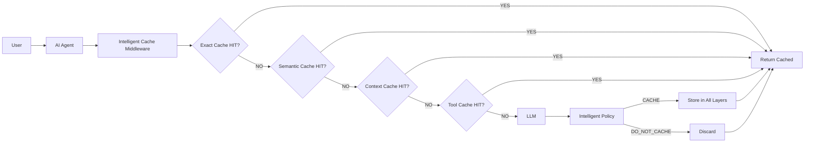

# Intelligent Caching Optimization Middleware for AI Agents

An M.Tech-level project demonstrating how intelligent multi-level caching can significantly reduce redundant LLM calls, latency, token usage, and inference costs for AI agent systems.

## Problem Statement

Modern AI agents interact with LLMs repeatedly for similar queries, leading to:
- **Redundant inference costs** — identical or paraphrased queries trigger full LLM calls
- **High latency** — LLM round-trips add 500ms–2000ms per request
- **Token waste** — repeated queries consume identical tokens
- **Scalability bottlenecks** — rate limits and API costs grow linearly with query volume

## Motivation

Caching in AI systems is often reduced to simple Redis key-value stores. This project demonstrates that **intelligent caching** — combining exact matching, semantic similarity, context awareness, tool determinism, and explainable cache policies — can optimize the trade-off between latency, cost, memory, and semantic correctness.

## Objectives

1. Design a multi-level cache middleware for AI agents
2. Implement exact, semantic, context, and tool caches
3. Build an explainable intelligent cache policy with weighted scoring
4. Demonstrate measurable latency reduction and cost savings
5. Provide quantitative benchmarking and visualization

## Architecture



### System Workflow

```text
User Query
    ↓
AI Agent
    ↓
Intelligent Cache Middleware
    ↓
┌───────────────────────────────┐
│ 1. Exact Cache (Redis)        │
│ 2. Semantic Cache (pgvector)  │
│ 3. Context Cache (PostgreSQL) │
│ 4. Tool Cache (Redis)         │
│ 5. Intelligent Policy         │
└───────────────┬───────────────┘
                │
           Cache HIT?
          /          \
        YES           NO
         ↓             ↓
    Cached Result     LLM
                       ↓
                  Store Result
                       ↓
                    Response
```

## Cache Types

### 1. Exact Cache (Redis)
- SHA256 deterministic key generation
- TTL-based expiration
- LRU-style eviction
- Hit count tracking

### 2. Semantic Cache (PostgreSQL + pgvector)
- `all-MiniLM-L6-v2` embeddings
- Cosine similarity search
- Configurable threshold (default: 0.85)
- Detects paraphrased queries

**Example:**
```text
"What is RAG?"
"Explain Retrieval Augmented Generation"
→ Semantic similarity: 0.92 → CACHE HIT
```

### 3. Context Cache (PostgreSQL)
- Session-based conversation context
- Reusable system instructions
- TTL-based context expiration

### 4. Tool Cache (Redis)
- Deterministic tool result caching
- Calculator, document lookup, weather tools
- Safe caching for idempotent operations


## Tech Stack

| Component | Technology |
|-----------|-----------|
| Backend | Python 3.11+, FastAPI, Uvicorn, Pydantic |
| Caching | Redis (exact/response/context/tool) |
| Database | PostgreSQL + pgvector |
| Embeddings | Sentence Transformers (`all-MiniLM-L6-v2`) |
| LLM | OpenAI-compatible API, Ollama, Mock provider |
| Frontend | Streamlit |
| Testing | Pytest, HTTPX |
| Visualization | Matplotlib, Plotly |
| Infrastructure | Docker Compose |


## Installation

### Prerequisites

- Python 3.11+
- Docker & Docker Compose
- Redis (via Docker Compose)
- PostgreSQL with pgvector (via Docker Compose)

### Setup

```bash
# Clone the repository
cd intelligent-ai-cache

# Create virtual environment
python -m venv venv
source venv/bin/activate  # On Windows: venv\Scripts\activate

# Install dependencies
pip install -r requirements.txt

# Copy environment configuration
cp .env.example .env
```

## Demo Workflow

```bash
# 1. Start services
docker-compose up -d

# 2. Start API
uvicorn app.main:app --host 0.0.0.0 --port 8000

# 3. First query — Cache MISS
curl -X POST "http://localhost:8000/generate" \
  -d '{"prompt": "What is Retrieval Augmented Generation?", "session_id": "demo"}'

# Expected:
# cache_status: MISS
# llm_called: true
# latency_ms: ~1000

# 4. Similar query — Semantic HIT
curl -X POST "http://localhost:8000/generate" \
  -d '{"prompt": "Explain Retrieval Augmented Generation.", "session_id": "demo"}'

# Expected:
# cache_status: HIT
# cache_type: semantic
# similarity_score: 0.87+
# llm_called: false
# latency_ms: ~15

# 5. Exact repeat — Exact HIT
curl -X POST "http://localhost:8000/generate" \
  -d '{"prompt": "What is Retrieval Augmented Generation?", "session_id": "demo"}'

# Expected:
# cache_status: HIT
# cache_type: exact
# llm_called: false
# latency_ms: ~15
```

## Limitations

- Semantic cache requires pgvector extension in PostgreSQL
- Sentence transformers model download (~100MB) on first run
- Mock provider uses deterministic responses based on query hash
- Benchmark results with mock provider show simulated latency improvements
- Single-node deployment (no distributed caching)

## Future Work

- [ ] Add Redis Cluster support for distributed caching
- [ ] Implement cache warming strategies
- [ ] Add more sophisticated embedding models (e.g., OpenAI embeddings)
- [ ] Support for streaming LLM responses
- [ ] Multi-tenant cache isolation
- [ ] Advanced eviction policies (LFU, ARC)
- [ ] Cache preloading from historical data
- [ ] Integration with popular agent frameworks (LangChain, AutoGen)
- [ ] Real-time cache performance alerts
- [ ] A/B testing framework for cache strategies

## License

MIT License - M.Tech Project

## References

- [pgvector](https://github.com/pgvector/pgvector)
- [Sentence Transformers](https://www.sbert.net/)
- [FastAPI](https://fastapi.tiangolo.com/)
- [Redis](https://redis.io/)
- [Streamlit](https://streamlit.io/)
